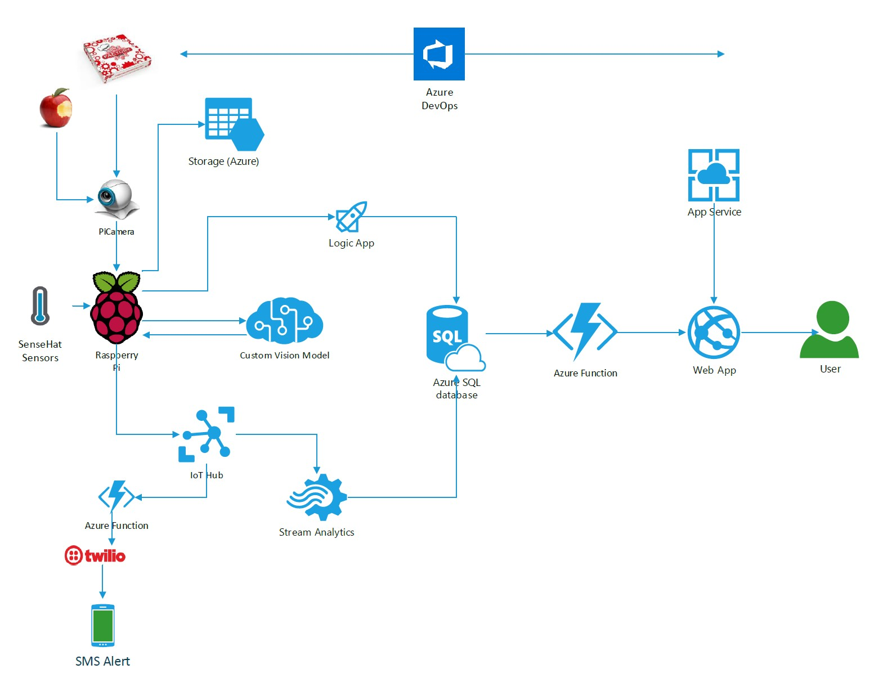

# Project Recycle

Project Recycle was my first technical project when I joined Microsoft in 2019. The inspiration for this project came from the bins located in the Melbourne office. 

In the Melbourne office, the rubbish that we throw away is separated into 3 bins: 
General Waste, Recycle, and Organic Waste. 

Mindful of waste contamination, I would always stop and read the signs carefully before throwing my rubbish away and then came the "Aha!" moment for me. 

What if we could leverage some of our powerful Azure services and build something to help classify our rubbish. 
With that in mind, I began Project Recycle....  

Let's start with the architecture diagram (my very first one I must add): 

