# Project Recycle

Project Recycle was my first technical project when I joined Microsoft in 2019. The inspiration for this project came from the bins located in the Melbourne office. 
In the Melbourne office, the rubbish that we throw away is separated into 3 bins: 
General Waste, Recycle, and Organic Waste. 
Mindful of waste contamination, I would always stop and read the signs carefully before throwing my rubbish away and then came the "Aha!" moment for me. 
What if we could leverage some of our powerful Azure services and build something to help classify our rubbish. 
With that in mind, I began Project Recycle....  


Let's start with the architecture diagram (my very first one I must add): 
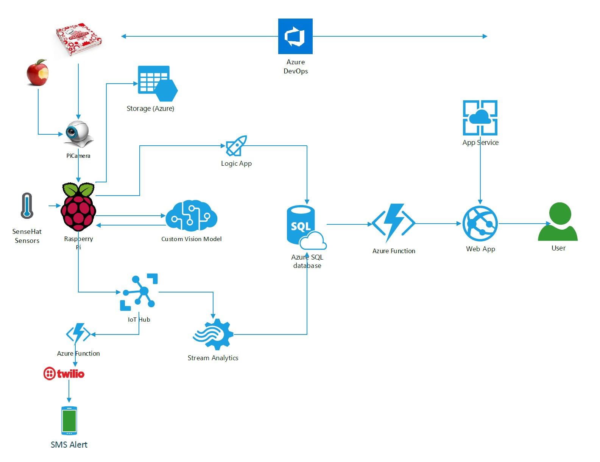

All the components in blue are Azure services. I'll include links to what each of those components are if you want to read up on them: 
1. [Azure DevOps](https://docs.microsoft.com/en-us/azure/devops/?view=azure-devops) was used to facilitate the source control, continuous integration and deployment of Project Recycle.
2. [Azure Storage](https://docs.microsoft.com/en-us/azure/storage/) is cloud-based storage used to store all the images captured by the Pi camera. 
3. [App Service](https://docs.microsoft.com/en-us/azure/app-service/) is used to host and run the Project Recycle web app. 
4. [Logic App](https://docs.microsoft.com/en-us/azure/logic-apps/) is used to insert data from the Raspberry Pi and custom vision model into an Azure SQL database. 
5. [Custom Vision Model](https://docs.microsoft.com/en-us/azure/cognitive-services/custom-vision-service/) is a machine learning model that is trained on a specific set of rubbish data sets for classification. 
6. [Azure SQL Database](https://docs.microsoft.com/en-us/azure/sql-database/) is a cloud-based relational SQL database used to store data from the Raspberry Pi in a structured way so that the web app can then query that data later on. 
7. [Azure Function](https://docs.microsoft.com/en-us/azure/azure-functions/) is severless compute used to extract data from the database and act as APIs to the web app. 
8. [Azure IoT Hub](https://docs.microsoft.com/en-us/azure/iot-hub/) is used to connect and communicate with the Raspberry Pi. 
9. [Azure Stream Analytics](https://docs.microsoft.com/en-us/azure/stream-analytics/) processes lots and lots of data by streaming all the high-speed, high-voulme sensor data from the Raspberry Pi into the Azure SQL database. 

Non-Azure things included: 
1. [Raspberry Pi](https://www.raspberrypi.org/documentation/) which is essentially a mini computer, an IoT device. 
2. [Raspberry Pi SenseHat](https://www.raspberrypi.org/documentation/hardware/sense-hat/) which includes a bunch of sensors you can just pop onto the Raspberry Pi if you don't have an electrical engineering background to wire things up. 
3. [Raspberry Pi Camera](https://projects.raspberrypi.org/en/projects/getting-started-with-picamera) which is basically a camera you can attach to the Raspberry Pi. 
4. [Twilio](https://www.twilio.com/) is a cloud-based communications platform used to send SMS or calls to alert someone if something with the Raspberry Pi goes wrong. 
5. Mouse, Keyboard, Power source.
6. WiFi

## And now, the fun part begins...setting up the Raspberry Pi: 
> Your Raspberry Pi may or may not come with the [Raspbian](https://www.raspberrypi.org/downloads/raspbian/) operating system. If it doesn't, you need to get an SD card, follow that link to install it. 
> If you haven't already, pop the Sensehat on the Raspberry Pi and attach the Pi camera as well. 
> Now connect the physical mouse and keyboard to the Raspberry Pi and plug Raspberry Pi into a power source. 
> Once you're in, find the WiFi symbol and connect the Raspberry Pi to the WiFi. You can keep using the mouse and keyboard to navigate the Pi but I like to install [VNC](https://www.realvnc.com/en/connect/download/viewer/) so I could remote access my Raspberry Pi. 
> Check that your Raspberry Pi has [Python](https://www.python.org/) installed, if not, install it. 

## Let's load some code into your Raspberry Pi: 
> Now, go to the browser on the Raspberry Pi. Find this GitHub Repo, go into the 'code' folder and pull down the code the says ['RaspberryPiCode.py'](code/RaspberryPiCode.py) onto the device. 
> I just saved mine to the desktop of the Raspberry Pi for ease of access.

## Setting up IoT on Azure: 
> Let's start with a Resource Group. The first thing you want to provision is a Resource Group which is a logical container or 'folder' to group all the resources related to this project: 
> 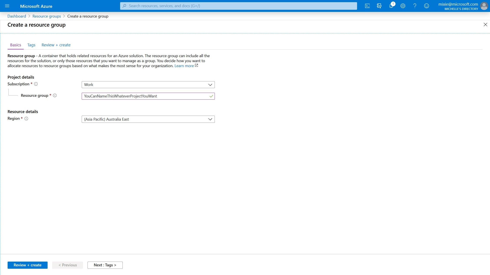

> Next, we want to provision an Azure IoT Hub so that we can connect to our Raspberry Pi: 
> 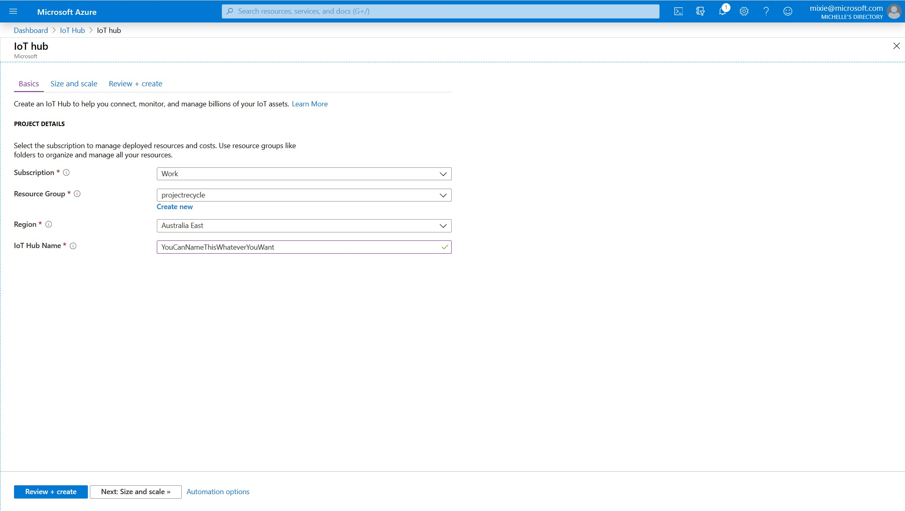

> Create a device in your Azure IoT Hub by navigating to 'IoT Devices' and clicking on '+ New': 
> 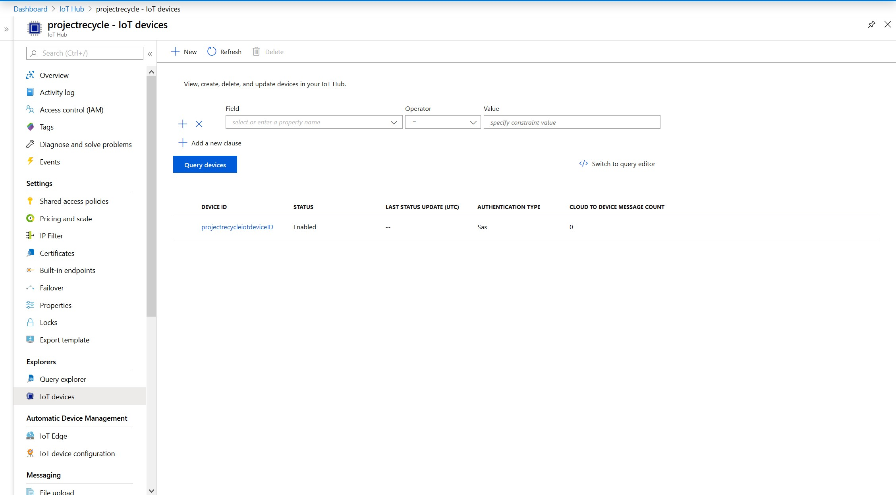
> 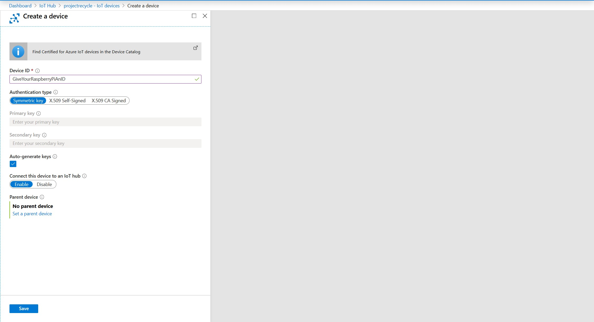

> Once your device has been provisioned, go into it to grab the connection string. Just use the primary connection string: 
> 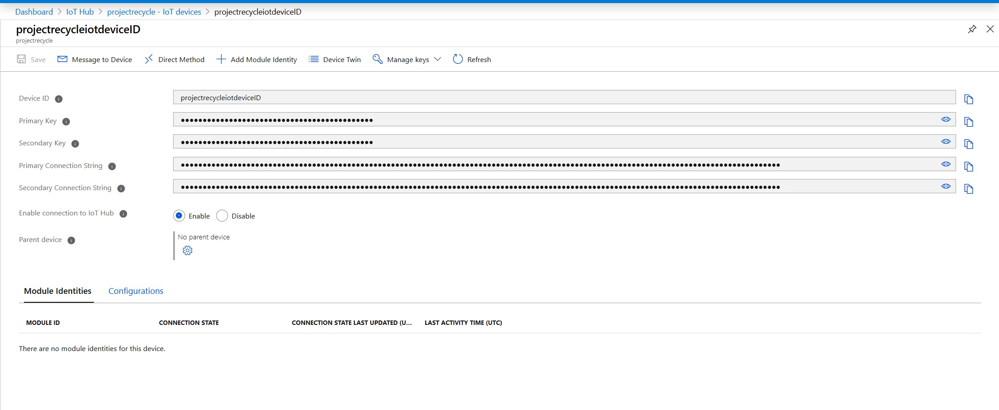

> Now, what you want to do is take that connection string and add it to the following code on the Raspberry Pi: 
> ```python
> iot_hub_connection_string = "{insert-iot-hub-connection-string}"

## Training your own Custom Vision model: 
> First of all, we need to deploy a Cognitive Services on Azure: 
> 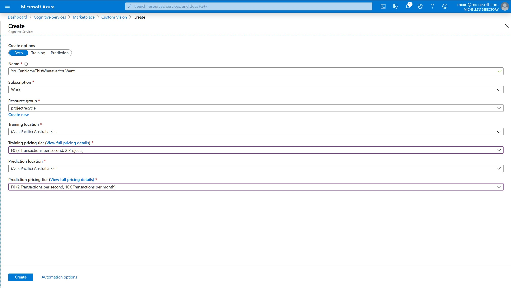

> Now go sign into [Custom Vision](https://www.customvision.ai/) and create a new project: 
> 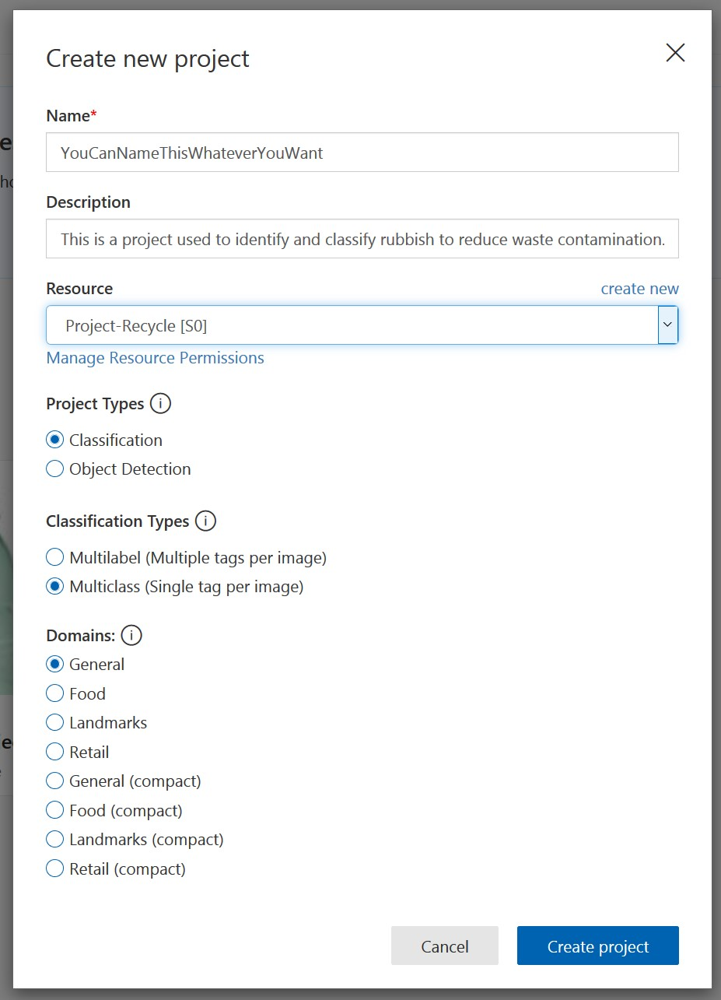

> You can truly CUSTOMISE this by creating your own dataset. Or, if like me, you can't be bothered. 
> You can use the ones I used.
> I'm not a data scienctist so I sourced most of these off Google Images. 
> You can combine the ones I've used here with your own as well. 

> For training data, download it from [here](https://projectrecycledata.blob.core.windows.net/customvisionmodeldata/training-data.zip).

> For testing data, download it from [here](https://projectrecycledata.blob.core.windows.net/customvisionmodeldata/testing-data.zip).

> For the training data, I have put them into categories within each label:
> 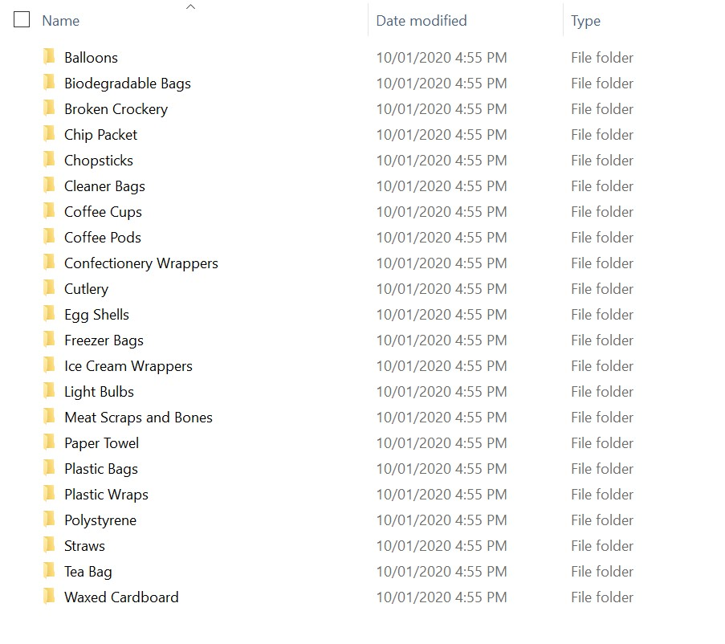

> Again, you can use all of the image data here, some of it, none of it, or add your own to it. This one for example will all be classified (labelled) as General Waste in the model. These are the only ones I could think of but of course there is more than that (otherwise we would have less rubbish in the world). Just keep in mind that the more data we have, the better our model would perform in the real world. 

> Now, go back to [Custom Vision](https://www.customvision.ai/) and navigate into the new project you have just created. 
> Once you've gathered your data sets, add these images to your Custom Vision model: 
> 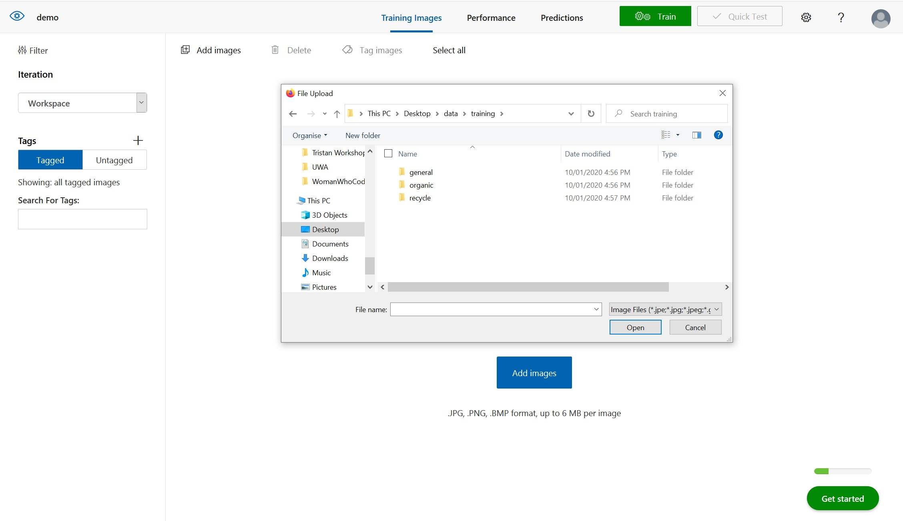

> And give it a label: general, recycle, or organic 
> 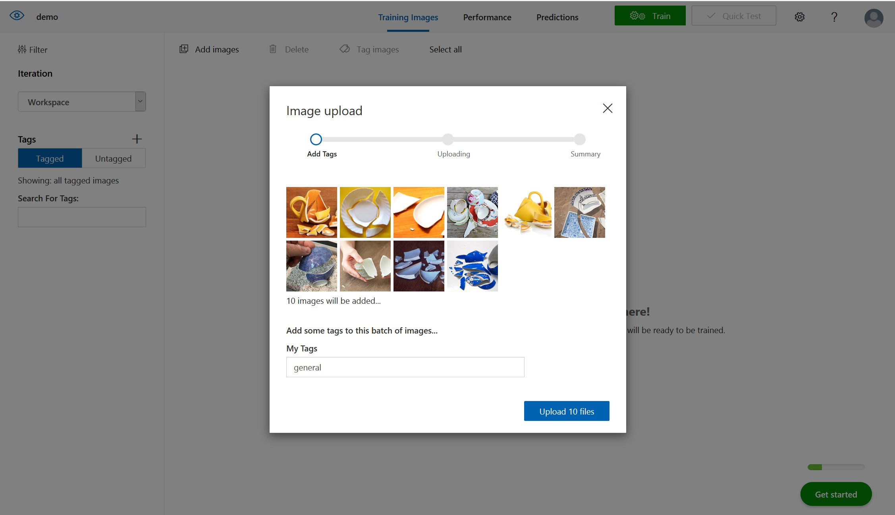

> Repeat for the other labels until you have added all images for all 3 labels (general, recycle, organic) into the project: 
> 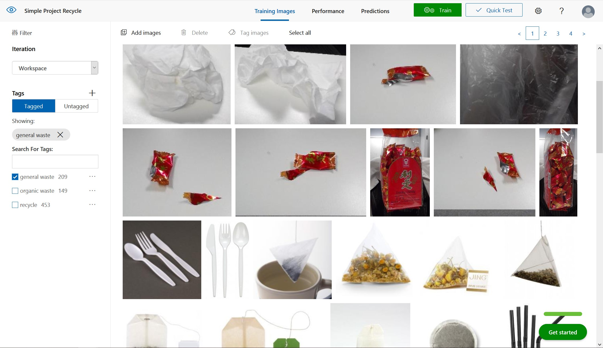

> Then hit the 'Train' button to train your model:
> 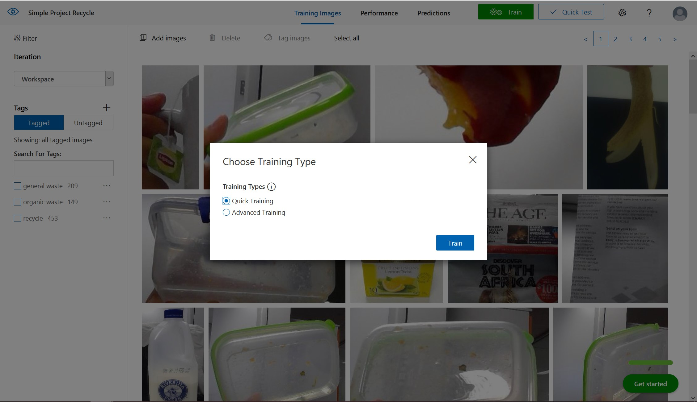

> Once trained, you can see how well your model performed on the training data: 
> 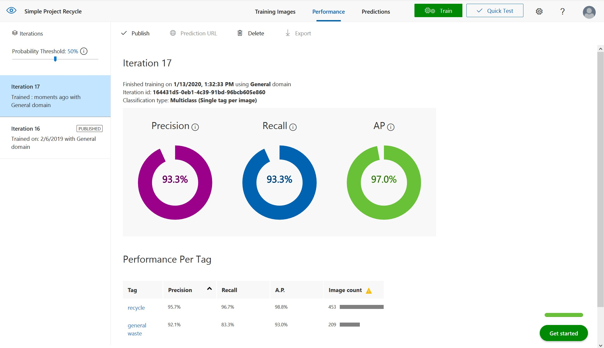

> You can save multiple iterations by using a combination of different data sets as well as perform a 'Quick test' with testing data to see how well your model performs on image data it has never seen before. You can perform the test by providing an image URL or uploading an image from your local computer: 
> 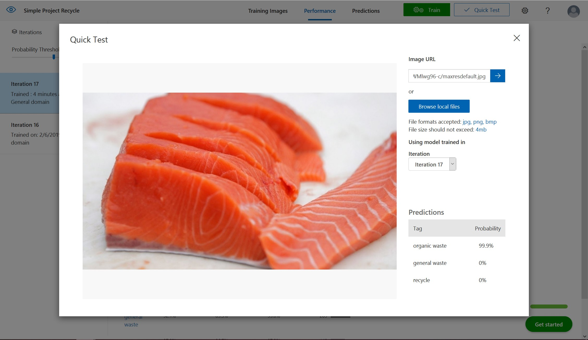

> Once you're satisfied with the performance, you can choose to publish that specific Iteration of the model. This will then give you a prediction API which you can then call to use your model: 
> 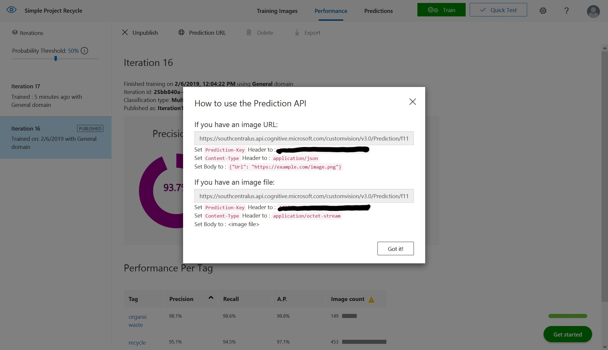

> Now, grab the Prediction-Key and insert it into prediction_key in ['RaspberryPiCode.py'](code/RaspberryPiCode.py) code:
> ```Python
> def custom_vision(image_name):
>    # Establishing key connections: 
>    training_key = "{insert-training-key}"
>    prediction_key = "{insert-prediction-key}"    
>    storage_account_url = "{insert-storage-account-url}"
>    ENDPOINT = "{insert-endpoint}"
>    pid = "{insert-pid}"

> Now, go to the Settings of your custom vision model project to find the training_key, ENDPOINT, and pid which is under 'Key', 'Endpoint' and 'Project Id' respectively: 
> 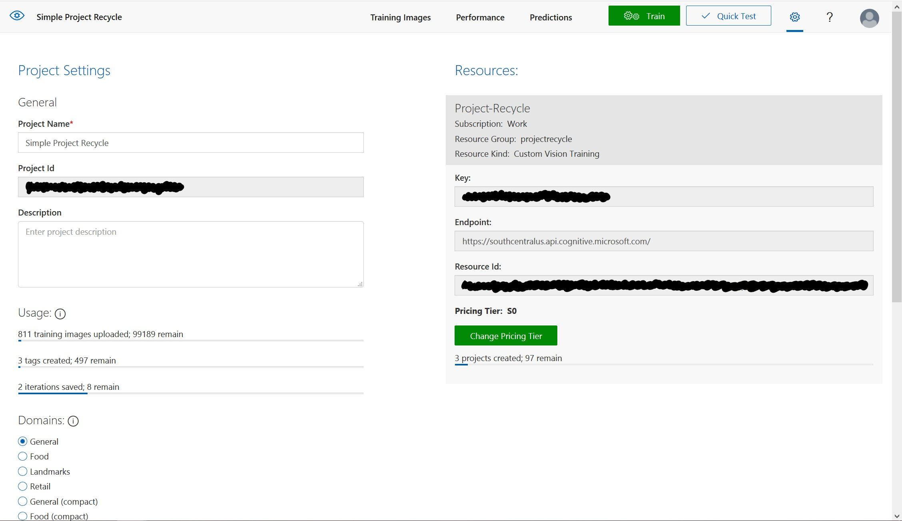

## Set up Azure Storage:
> Just like everyone who throws things they don't know what to do with into their garage, let's throw our images into an Azure Storage account. 
> I'm just kidding, we actually need those images so let's create an Azure Storage account to store all the images we capture from the Raspberry Pi. 
> First, go to your Azure portal and look up 'Storage account' and create one following these configurations: 
> 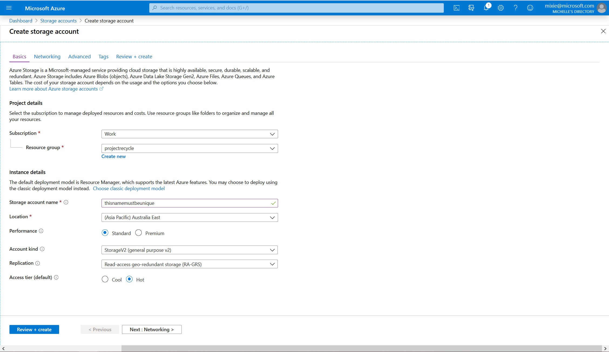

> Once your Storage account has been created, navigate to 'Access keys' and copy the 'Storage account name' and 'Key' from key1 and insert it into account_name and account_key respectively in the ['RaspberryPiCode.py'](code/RaspberryPiCode.py) code:
> 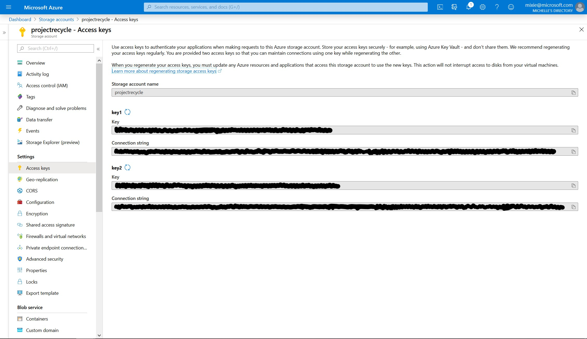
> ```Python 
> # Blob storage connection:
> def blob(file_path, blob_name):
>    block_blob_service = BlockBlobService(account_name='{insert-account-name}', account_key='{insert-account-key}')
>    container_name = 'iotimage'
>    block_blob_service.create_blob_from_path(container_name, blob_name, file_path, 
> content_settings=ContentSettings(content_type='image/jpeg'))

> Now, navigate to Storage Explorer, right-click on Blob Containers and click 'Create blob container' and name it 'iotimage':
> 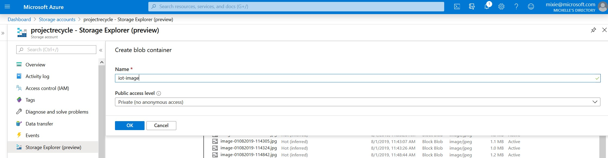

> You can also do this in Azure Storage Explorer if you have it installed already: 
> 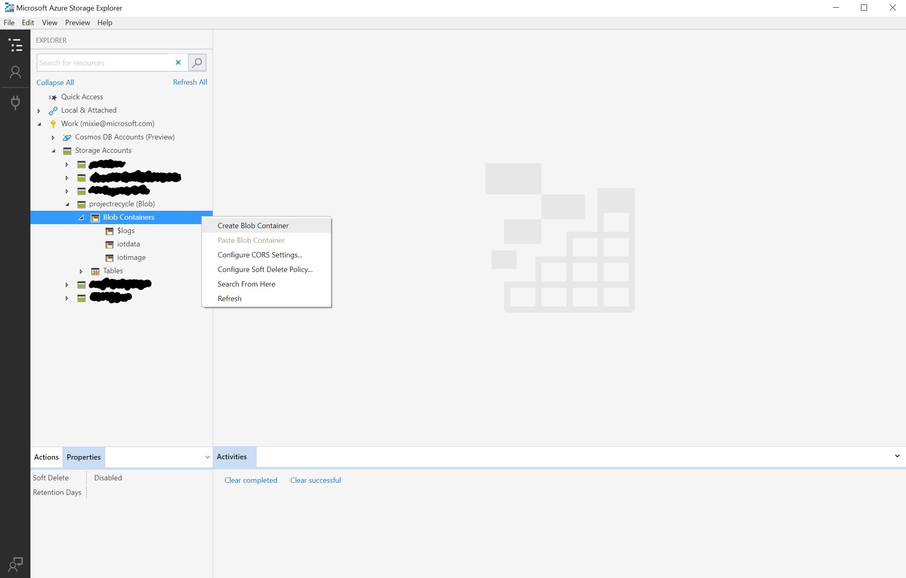

> Now, navigate to Containers under Blob service, find the container you just created, click on the 3 dots at the end and go into Container Properties: 
> 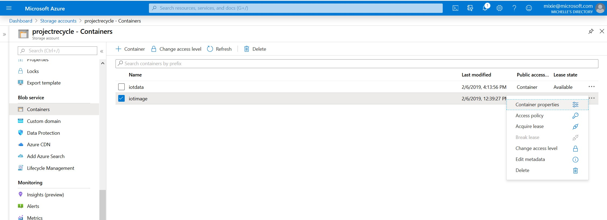
> 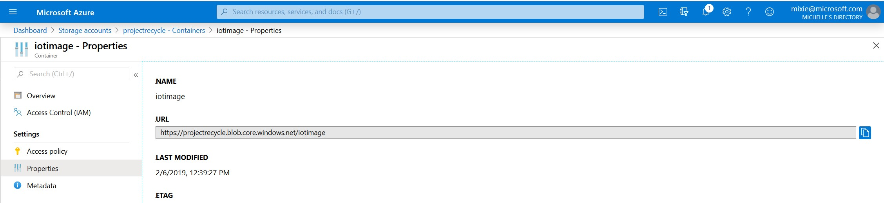

> Copy the URL and insert it into two places in the ['RaspberryPiCode.py'](code/RaspberryPiCode.py) code: 
> ```Python
> storage_account_url = "{insert-storage-account-url}"

## Create an Azure SQL Database: 
> We want a way to store the data in a structured or semi-structured way so that on the other end, we can query it from an application later on. Why? Mainly to show off (the power of our model)!

> First, we will create an Azure SQL Database from the portal: 
> 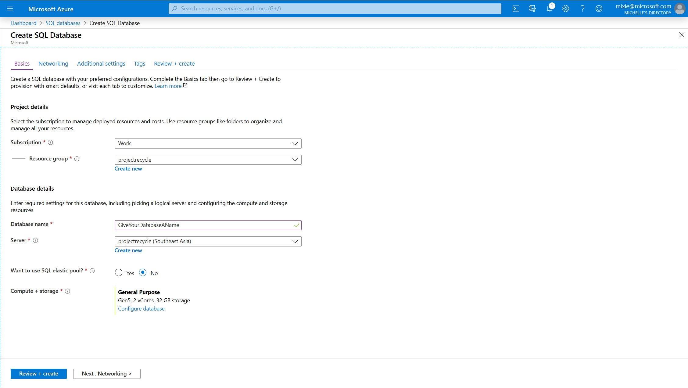

> When you're creating an Azure SQL Database for the first time, you'll need to set up a SQL server: 
> 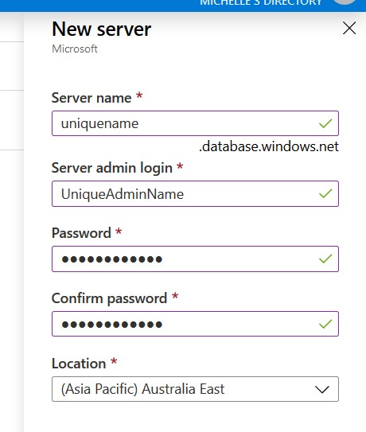

> You'll also want to scale it down because the default is anticipating Enterprise needs (which will incur a massive bill for a personal project): 
> 

> Next, we want to create a Table in our database to store data in a structured format. Copy this SQL query: 
> ```SQL
> CREATE TABLE Predictions(
>	PredictionId int IDENTITY(1,1) NOT NULL,
>	ImageUrl text NOT NULL,
>	GeneralWasteProb float NOT NULL,
>	RecycleProb float NOT NULL,
>	OrganicProb float NOT NULL,
>	ClassifiedAs varchar(50) NULL
> )

> Navigate to the Query editor and login to your SQL server (I hope you remembered your username and password!):
> 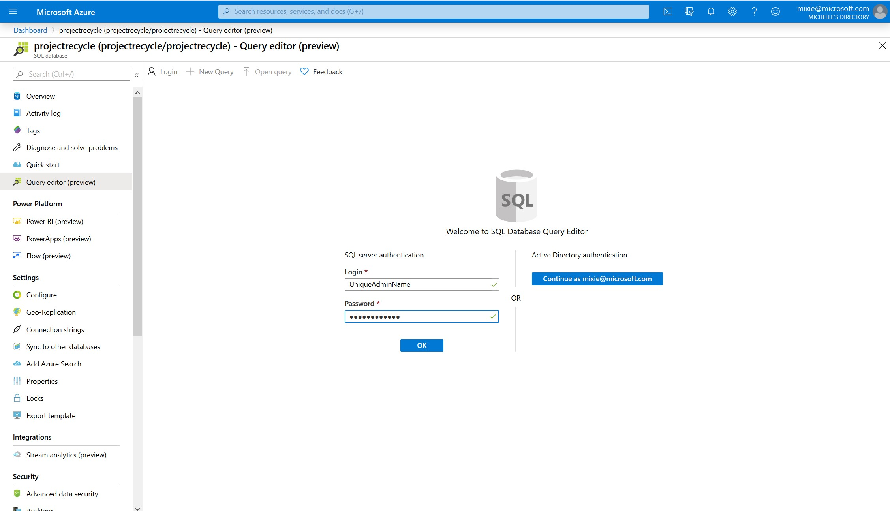

> Then paste that query you just copied into the query editor and hit 'Run':
> 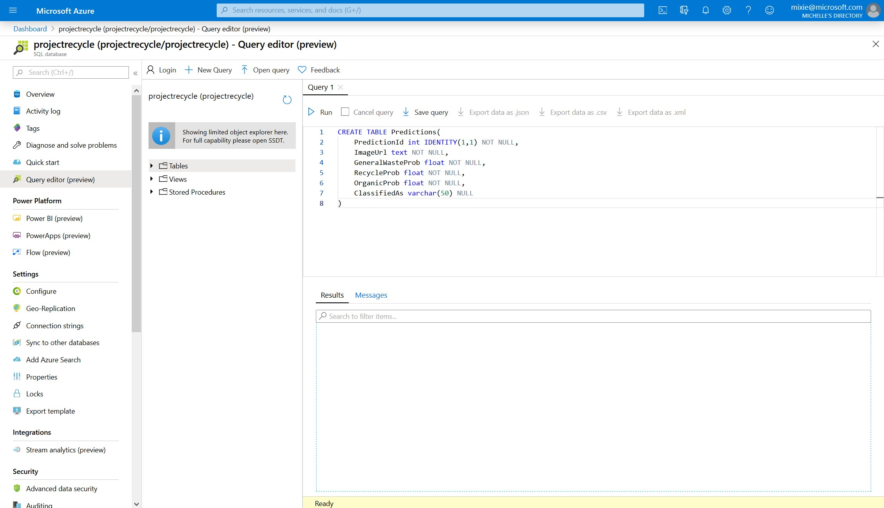

> Again, if you have Azure Data Studio installed, you can alternatively do the same thing using Azure Data Studio: 
> 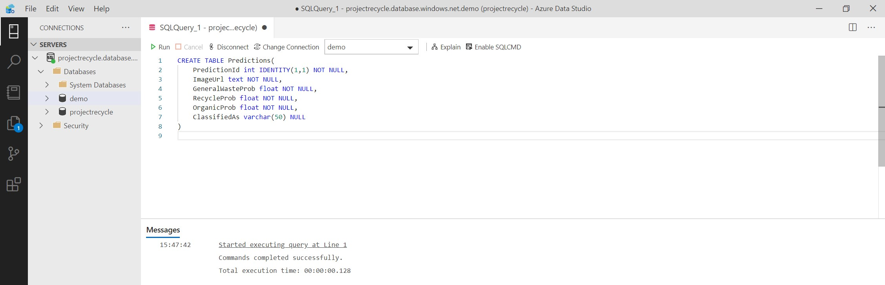

## Use Logic Apps to save you the pain: 
> I spent about a week trying to insert the data directly from the Raspberry Pi into my SQL Database. Then I spent another week crying because everything keeps breaking. And then I realised that my Raspberry Pi could get compromised so in fear of my device being hacked and someone gaining access to my database credentials, I started looking into Logic Apps...

> We are going to create a Logic App and ask it (politely) to insert the data into the database. 
> 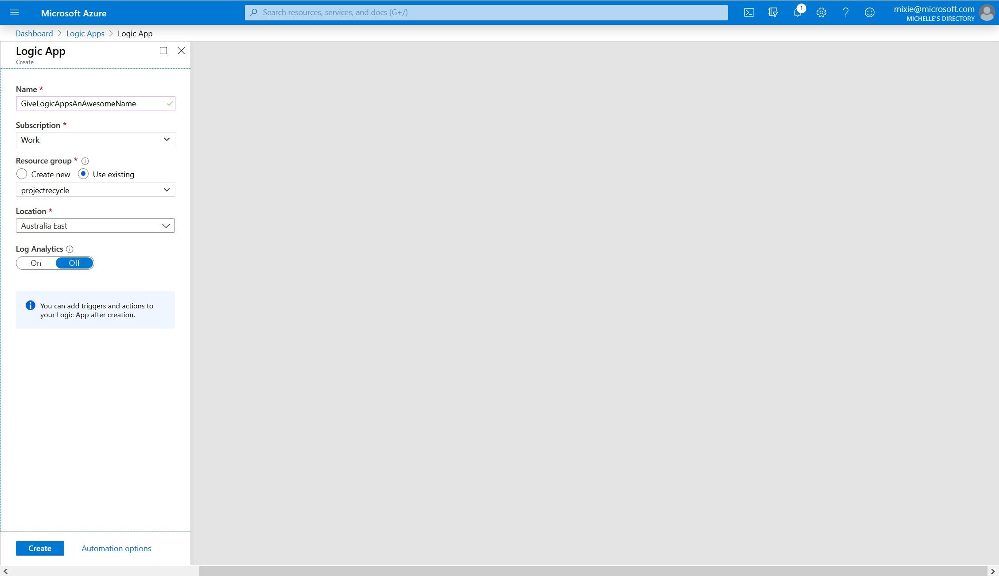


